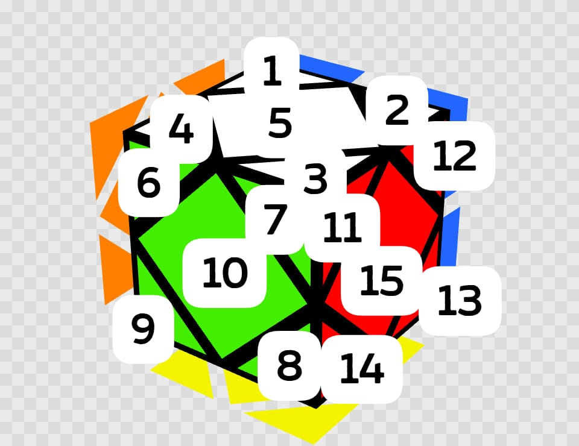
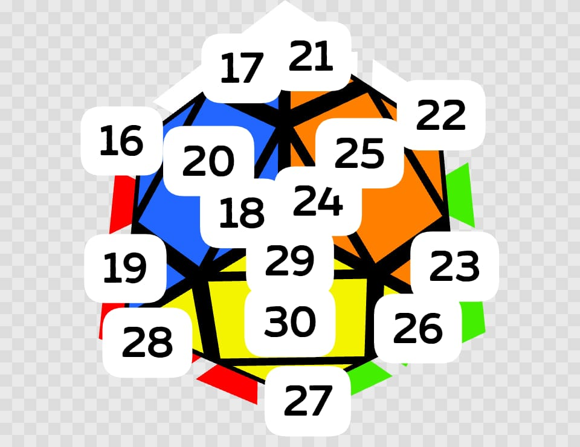

# Skewb Solver (Monte Carlo)

## About the Project

This programme allows user to capture all sides of the skewb, and solve it with the algorithm found by using Monte Carlo.

## Getting Started

### Installation

To be able to run the python programme, you need to have numpy, Pillow and OpenCV installed.

* numpy
  ```cmd
  pip install numpy
  ```
  
* Pillow
  ```cmd
  pip install pillow
  ```
* OpenCV
  ```cmd
  pip install opencv-python
  ```

### Preparation
Please put all the files and folders in the same directory.

The colour input is done by python opencv, and the skewb algorithm finder is done in C++ using Monte Carlo. Therefore, you need to first compile the C++ programme.
* Compile the C++ script
  ```cmd
  g++ skewb_solution_finder.cpp -o a
  ```

Then, after you scanned the cube using the python programme, it will run the compiled file.

This programme requires you to connect a webcam to the computer, 

* Change the webcam number in the code in line 8 of skewb_solver.py if necessary.
  ```python
  cap = cv2.VideoCapture(0)
  ```

* If you are using a linux system, change the code as following.
  ```python
  cap = cv2.VideoCapture(0, cv2.CAP_V4L2)
  ```

## Usage
The main code is in **skewb_solver.py**. Run this python script and scan each face of the skewb. When you scan the skewb, you have to first find the white-green-red corner and place it at bottom right with white facing up. **Press enter** to capture a face, then follow the animation in the OpenCV preview window to rotate the cube to scan the next face. Should you have any difficulty scanning the cube, you could take a look at the [demo video](https://law-chun-man.github.io/Skewb_Solver/demo.mp4).

<div class="video-container">
    <video width="640" height="360" controls allowfullscreen>
        <source src="demo.mp4" type="video/mp4">
        Your browser does not support the video tag.
    </video>
</div>

After scanning all faces, the python programme will return the skewb algorithm. The skewb algorithm follows the WCA standard notation. Please refer to quick guide to WCA skewb notation [video](https://law-chun-man.github.io/Skewb_Solver/notation.mp4). 

<div class="video-container">
    <video width="640" height="360" controls allowfullscreen>
        <source src="notation.mp4" type="video/mp4">
        Your browser does not support the video tag.
    </video>
</div>

Or, you could just click the link in the terminal under the skewb algorithm for the animation of showing the algorithm as shown in the [demo video](https://law-chun-man.github.io/Skewb_Solver/demo.mp4).

## More Customisation

Let's say you are right handed, you might want an algorithm that contain less lefty moves. You could actually tune the ratio of the probability of the type of turns that come up in Monte Carlo simulation. 

* Tune the numbers in line 8 of **skewb_solution_finder.cpp**. The numbers in array mean the probability of R showing up to L to U to B respectively.
  ```cpp
  int ratio[4] = {1, 1, 1, 1};
  ```
* If you change the array to {3, 1, 1, 1}, R moves will come up 3 times more frequently than L, U and B moves.
 
## How it works

In the **skewb_solution_finder.cpp**, I defined the skewb using 3 arrays, one for position of centres, one for permutation of corners, and one for orientation of corners. When you compiled and run this script, you could input the colours one by one in the order shown below (note that if you use run **skewb_solver.py** and scan the cube, it will automatically input the colour for you).

* Input w for white, g for green, r for red, b for blue, o for orange, y for yellow.




Then there is a function that converts the colours to the 3 arrays that define the skewb's state.

### Monte Carlo

This programme will then do random moves to the skewb and check whether it is solved after each moves. If solution is not found after doing 12 moves (one more move than God's number, the maximum number of moves required to solve a skewb), it will search for next algorithm. The programme will avoid applying duplicated moves, such as R after R or R'. The Monte Carlo simulation will also be based on the ratio set in line 8 of the code.

## Finding fewest moves solution

I added a for loop to the **skewb_solution_finder.cpp** to search for solution for 100 times, and return the solution with the fewest move count (saved to **fewest_move_finder.cpp**).

Then I tried to find the moves needed to solve the 5 scrambles of Carter Kucala's final round at Going Fast in Grandview 2024 using this programme. The reason I chose this average was because the last solve was the world record single, but he did not perform that well in other solves. The table below shows the time, scramble, number of moves found by my programme.

| Solve  | Result  |      Scramble(11 moves)       | Fewest number of moves  |
|:------:|:-------:|:-----------------------------:|:-----------------------:|
|   1    |  2.49   |  R B L’ U’ L’ R B’ R’ B R B   |            9            |
|   2    |  1.77   | U L U’ B’ U’ B’ U’ L B U’ R’  |            9            |
|   3    |  3.32   |  U L B U’ B’ L’ B R’ B’ L U   |            7            |
|   4    |  4.65   |   R B’ U’ B U B L’ U B’ U R   |            8            |
|   5    |  0.75   |   B L R’ B’ L U B’ R U’ R U   |            8            |

For the last solve, he did find the 8 moves solution. However, he did not find the 7 moves solution for the third solve. This shows that the current method that the top solvers are using (NS algorithm) is unable to attain the fewest moves solution.

It's also worth noting that the third fastest solve was done by Simon Kellum in this same competition, solving that same scramble! This shows that luck really play a role in skewb solves.
